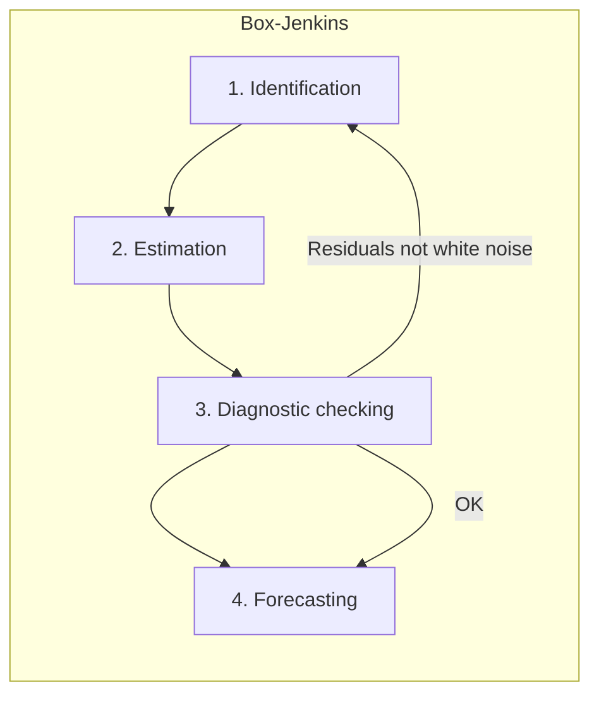

# Week 8A – ARIMA Models and Box–Jenkins Methodology (Theory)

**Part of:** Week 8 – ARIMA and Box–Jenkins Methodology  
**Format:** Lecture (theory and methodology)  
**CLOs:** 3.1, 4.1, 5.1, 6.1  
**See also:** [week8B_teaching_content.md](week8B_teaching_content.md) (forecasting, pipeline, Python, Homework 4)

---

## 1. Learning objectives (Week 8A)

By the end of this part, you should be able to:

- **Define** ARIMA(p,d,q) precisely: differencing, backshift notation, and the link to ARMA on the differenced series.
- **Explain** the role of **d** (differencing order), **p** (AR order), and **q** (MA order) and how they are chosen in practice.
- **Describe** the four steps of the Box–Jenkins methodology (Identification, Estimation, Diagnostic checking, Forecasting) and when to iterate back to identification.
- **Use** AIC and BIC to compare candidate models and interpret residual diagnostics (ACF of residuals, Ljung–Box test).
- **State** the formulas for forecast error metrics (MAE, RMSE, MAPE) and when each is appropriate.

---

## 2. Prerequisites

Week 8 builds on **Weeks 6 and 7**. You should be comfortable with:

### 2.1 Stationarity

- **Definition:** A series \(\{X_t\}\) is (weakly) stationary if its mean \(E[X_t]\), variance \(\mathrm{Var}(X_t)\), and autocovariance \(\mathrm{Cov}(X_t, X_{t-k})\) do not depend on time \(t\).
- **Implication:** ARMA models are defined for stationary series; non-stationary series (e.g. with a unit root or trend) are first differenced.

### 2.2 Unit root and Augmented Dickey–Fuller (ADF) test

- **Unit root:** In the model \(X_t = \phi_1 X_{t-1} + \cdots + \varepsilon_t\), if \(\phi_1 = 1\) we have a unit root: the series is non-stationary (e.g. random walk).
- **ADF test:** Null hypothesis \(H_0\): the series has a unit root (non-stationary). Alternative: no unit root (stationary).
- **Usage:** If the **p-value is small** (e.g. &lt; 0.05), we **reject** \(H_0\) and conclude the series is **stationary**. If the p-value is **large**, we do not reject \(H_0\) and treat the series as **non-stationary**; then we difference and test again.

### 2.3 Differencing

- **First difference:** \(\nabla X_t = X_t - X_{t-1}\). Removes a stochastic trend (e.g. random walk).
- **Second difference:** \(\nabla^2 X_t = \nabla(\nabla X_t) = X_t - 2X_{t-1} + X_{t-2}\). Used when one difference is not enough.
- We choose **d** as the smallest number of differences such that the resulting series is judged stationary (e.g. by ADF).

### 2.4 AR, MA, and ARMA

- **AR(p):** \(X_t = c + \phi_1 X_{t-1} + \cdots + \phi_p X_{t-p} + \varepsilon_t\). Past values of the series predict the current value.
- **MA(q):** \(X_t = \mu + \varepsilon_t + \theta_1 \varepsilon_{t-1} + \cdots + \theta_q \varepsilon_{t-q}\). Current value depends on current and past shocks.
- **ARMA(p,q):** Combines AR(p) and MA(q) on a **stationary** series.
- **ACF/PACF:** For **AR(p)**, the **PACF** “cuts off” after lag p (spikes at lags 1,…,p, then roughly zero). For **MA(q)**, the **ACF** cuts off after lag q. For **ARMA(p,q)**, both ACF and PACF tail off (exponential decay). These patterns are used to **identify** (p,q) from the **differenced** series.

**Supporting materials:** Slides 4.1 and 4.2; [../week6_7_exercise/README.md](../week6_7_exercise/README.md); [../acf_problem_set.md](../acf_problem_set.md).

---

## 3. ARIMA(p,d,q) models – complete treatment

### 3.1 Definition

**ARIMA** stands for **A**uto**R**egressive **I**ntegrated **M**oving **A**verage.

- **Integrated** means “differenced”: we work with the \(d\)-th difference of the original series.
- **ARIMA(p,d,q)** is defined as follows:
  1. Form the **differenced series** \(W_t = \nabla^d X_t\).
  2. Assume \(W_t\) is **stationary**.
  3. Model \(W_t\) as an **ARMA(p,q)** process.

So the **equation** is in terms of \(W_t\): the AR and MA parts apply to the differenced series, not the raw \(X_t\). If \(d = 0\), then \(W_t = X_t\) and the model is simply **ARMA(p,q)** on the original series (no differencing).

### 3.2 Backshift notation

The **backshift operator** \(B\) is defined by:
\[
B X_t = X_{t-1}, \quad B^k X_t = X_{t-k}.
\]

- **First difference:** \((1 - B) X_t = X_t - X_{t-1} = \nabla X_t\).
- **d-th difference:** \(\nabla^d = (1-B)^d\). So \(\nabla^d X_t\) is a linear combination of \(X_t, X_{t-1}, \ldots, X_{t-d}\).

The ARIMA(p,d,q) model can be written in operator form as:
\[
\phi(B) (1-B)^d X_t = c + \theta(B) \varepsilon_t,
\]
where \(\phi(B) = 1 - \phi_1 B - \cdots - \phi_p B^p\) is the AR polynomial and \(\theta(B) = 1 + \theta_1 B + \cdots + \theta_q B^q\) is the MA polynomial, and \(\{\varepsilon_t\}\) is white noise. The “(1-B)^d” part is the integration (differencing); the ARMA part is \(\phi(B) W_t = c + \theta(B) \varepsilon_t\) with \(W_t = (1-B)^d X_t\).

### 3.3 Role of d (differencing order)

- **d = 0:** The series \(X_t\) is already stationary. No differencing; the model is ARMA(p,q) on \(X_t\).
- **d = 1:** The **first difference** \(\nabla X_t = X_t - X_{t-1}\) is stationary. Typical for series with a **stochastic trend** (e.g. random walk). We choose d=1 when:
  - ADF on the **raw** series does **not** reject the unit root (p-value large), and
  - ADF on \(\nabla X_t\) **does** reject the unit root (p-value small).
- **d = 2:** The **second difference** is stationary. Used when one difference is insufficient (e.g. ADF on \(\nabla X_t\) still suggests non-stationarity). Less common in practice.

**How to choose d:** Apply ADF (and optionally KPSS) on the raw series. If non-stationary, difference once and test again; repeat until the differenced series is stationary. Set d = number of differences applied. The **ACF** of the raw series can also help: very **slow decay** (e.g. high autocorrelation at large lags) suggests non-stationarity and the need for differencing.

### 3.4 Interpretation of p and q

**p (AR order):** Number of **lagged values of the differenced series** \(W_t = \nabla^d X_t\) in the equation. So we use \(W_{t-1}, \ldots, W_{t-p}\) to predict \(W_t\). Interpretation: the **differenced** series has a memory of p steps. The **PACF** of \(W_t\) often **cuts off** after lag p (significant at lags 1,…,p, then inside the confidence band).

**q (MA order):** Number of **lagged innovations (errors)** in the equation. So the current shock and the last q shocks (\(\varepsilon_t, \varepsilon_{t-1}, \ldots, \varepsilon_{t-q}\)) affect \(W_t\). Interpretation: the process “remembers” the last q shocks. The **ACF** of \(W_t\) often **cuts off** after lag q.

### 3.5 Examples

| Model | Meaning | When to consider |
|-------|---------|------------------|
| **ARIMA(1,1,0)** | First difference follows AR(1): \(W_t = c + \phi_1 W_{t-1} + \varepsilon_t\). | PACF of \(\nabla X_t\) cuts off after lag 1. |
| **ARIMA(0,1,1)** | First difference follows MA(1): \(W_t = \mu + \varepsilon_t + \theta_1 \varepsilon_{t-1}\). | ACF of \(\nabla X_t\) cuts off after lag 1. |
| **ARIMA(1,1,1)** | First difference follows ARMA(1,1). | Both ACF and PACF of \(\nabla X_t\) suggest AR and MA structure. |

These three are standard candidates in the course (e.g. [../week6_7_exercise/solution_key.ipynb](../week6_7_exercise/solution_key.ipynb)). More detail on ACF/PACF interpretation: [../acf_problem_set.md](../acf_problem_set.md).

---

## 4. Box–Jenkins methodology – complete treatment

The **Box–Jenkins** approach (Box & Jenkins, 1970) is a systematic, iterative procedure to build ARIMA models. It has four steps; if diagnostic checking fails, we return to **Identification** and try a different model.

### 4.1 Step 1: Identification

**Goal:** Choose the orders **(d, p, q)**.

**1.1 Choose d**

- Plot the series; look for trend, non-constant mean.
- Run the **ADF test** on the **raw** series. If we **do not reject** the unit root (p-value &gt; 0.05), the series is treated as non-stationary.
- Compute the **first difference** \(\nabla X_t\), plot it, and run ADF on \(\nabla X_t\). If we **reject** the unit root (p-value &lt; 0.05), the first difference is stationary → set **d = 1**.
- If the first difference is still non-stationary, repeat with \(\nabla^2 X_t\) and set **d = 2**. In practice we use the **smallest d** such that the differenced series is stationary.

**1.2 Choose (p, q)**

- Work with the **differenced** series \(W_t = \nabla^d X_t\).
- Plot **ACF** and **PACF** of \(W_t\) (e.g. 20–40 lags).
- **Guidelines:**
  - **PACF** cuts off after lag **p** (spikes at 1,…,p, then roughly zero) → try **AR(p)** on \(W_t\) → **ARIMA(p, d, 0)**.
  - **ACF** cuts off after lag **q** (spikes at 1,…,q, then roughly zero) → try **MA(q)** on \(W_t\) → **ARIMA(0, d, q)**.
  - **Both** ACF and PACF tail off (exponential decay, no clear cutoff) → try **ARIMA(p, d, q)** with small p and q (e.g. 1,1,1).
- It is good practice to **identify 2–3 candidate** orders (e.g. (1,1,0), (0,1,1), (1,1,1)) and compare them in the next step.

Detailed examples (AR(1), MA(2), ARIMA(1,1,0), etc.) and figures: [../acf_problem_set.md](../acf_problem_set.md).

### 4.2 Step 2: Estimation

**Goal:** Estimate the parameters of the chosen ARIMA(p,d,q) model.

- **Method:** Usually **maximum likelihood (ML)**. The likelihood is built from the Gaussian assumption on the innovations \(\varepsilon_t\); the model is fit by maximizing the log-likelihood with respect to the AR/MA coefficients and the innovation variance.
- **Output:** Estimated coefficients (e.g. \(\hat{\phi}_1, \hat{\theta}_1\)), their **standard errors**, and fit statistics: **log-likelihood**, **AIC**, **BIC**.
- **Software:** In Python, `ARIMA(y, order=(p,d,q)).fit()` in Statsmodels performs this estimation.

We typically **estimate all candidate models** from Identification and compare them using AIC/BIC (see Section 5).

### 4.3 Step 3: Diagnostic checking

**Goal:** Check whether the **residuals** of the fitted model behave like **white noise**.

**White noise** means: zero mean, constant variance, and **no autocorrelation** (residuals at different times are uncorrelated). If the model is adequate, the residuals should approximate the unobserved innovations \(\varepsilon_t\), which are assumed white noise.

**3.1 ACF of residuals**

- Plot the **sample ACF** of the residuals \(\hat{\varepsilon}_t\).
- Under the null of white noise, the theoretical ACF is zero at all lags \(k \geq 1\). The sample ACF will fluctuate; we use **confidence bands** (e.g. \(\pm 1.96/\sqrt{n}\)).
- **Interpretation:** If most spikes lie **within** the bands, we have no strong evidence against white noise. **Spikes outside** the bands suggest remaining autocorrelation → model may be inadequate; consider adding AR or MA terms or changing (p,d,q).

**3.2 Ljung–Box test**

- **Null hypothesis \(H_0\):** The residuals are **uncorrelated** up to lag \(K\) (i.e. the first \(K\) autocorrelations of the residuals are zero).
- **Test statistic:** Based on the sum of squared sample autocorrelations of the residuals, which under \(H_0\) follows approximately a chi-squared distribution with \(K\) degrees of freedom (adjusted for estimated parameters).
- **Interpretation:** **Large p-value** (e.g. &gt; 0.05) → we do **not** reject \(H_0\) → residuals are consistent with white noise → **model adequate**. **Small p-value** → reject \(H_0\) → significant autocorrelation in residuals → **model inadequate**; return to Identification.
- **Usage:** In Statsmodels, `acorr_ljungbox(resid, lags=[1,2,...,K], return_df=True)` returns the test statistic and p-value for each lag set.

**3.3 Optional checks**

- **Normality:** QQ-plot or normality tests on residuals. Many results (e.g. forecast intervals) assume normal innovations; slight non-normality may be acceptable.
- **Homoscedasticity:** Plot residuals over time; look for changing variance.

If **any** of these checks fail, we **go back to Step 1 (Identification)**: try a different (p,d,q), then re-estimate and re-check.

### 4.4 Step 4: Forecasting

**Goal:** Use the fitted, diagnostically adequate model to produce **point forecasts** (and optionally **forecast intervals**) for future observations.

- **Point forecast:** For horizon \(h\), we predict \(X_{n+h}\) given data up to time \(n\). The forecast is the conditional expectation \(E[X_{n+h} \mid X_1,\ldots,X_n]\) under the model.
- **Evaluation:** If we have a **hold-out** period, we compare forecasts to actuals and compute **MAE**, **RMSE** (and optionally MAPE). See Section 5.3 and [week8B_teaching_content.md](week8B_teaching_content.md).

The full forecasting discussion (multi-step vs rolling one-step, forecast intervals) is in **Week 8B**.

---

## 5. Model selection – definitions and formulas

### 5.1 AIC and BIC

**Akaike Information Criterion (AIC):**
\[
\mathrm{AIC} = -2 \ln L + 2k,
\]
where \(L\) is the **maximized likelihood** of the model and \(k\) is the **number of estimated parameters** (including the constant and innovation variance).

**Bayesian Information Criterion (BIC),** also called Schwarz Criterion (SC):
\[
\mathrm{BIC} = -2 \ln L + k \ln n,
\]
where \(n\) is the **sample size** (number of observations used in estimation).

**Interpretation:**

- **Lower is better** for both AIC and BIC: they balance **fit** (higher \(L\) → lower \(-2\ln L\)) and **parsimony** (penalty for \(k\)).
- **BIC** penalizes complexity more than AIC (because \(\ln n &gt; 2\) for \(n &gt; 8\)). So BIC tends to favour **simpler** models (smaller p, q).
- In the course we often **choose the model with the smallest BIC** among candidates, or the smallest AIC if we prefer a bit more flexibility.

**Usage:** After fitting each candidate ARIMA, compare `fit.aic` and `fit.bic`; choose the model that minimizes the chosen criterion (typically BIC). See [../week6_7_exercise/solution_key.ipynb](../week6_7_exercise/solution_key.ipynb).

### 5.2 Residual diagnostics – summary

| Check | What to do | Good outcome |
|-------|------------|--------------|
| **ACF of residuals** | `plot_acf(fit.resid, lags=...)` | All lags (except 0) within confidence band \(\pm 1.96/\sqrt{n}\). |
| **Ljung–Box** | `acorr_ljungbox(fit.resid, lags=[...], return_df=True)` | p-value &gt; 0.05 for the chosen lags (e.g. 1–10 or 1–20). |

If the outcome is **not** good, treat the model as inadequate and return to **Identification**.

### 5.3 Forecast error metrics – formulas and interpretation

For **actual values** \(y_1, \ldots, y_n\) and **forecasts** \(\hat{y}_1, \ldots, \hat{y}_n\) (e.g. on a test set):

**Mean Absolute Error (MAE):**
\[
\mathrm{MAE} = \frac{1}{n} \sum_{i=1}^n |y_i - \hat{y}_i|.
\]
- Interpretation: Average absolute forecast error. Same units as the series. Robust to occasional large errors.

**Root Mean Squared Error (RMSE):**
\[
\mathrm{RMSE} = \sqrt{\frac{1}{n} \sum_{i=1}^n (y_i - \hat{y}_i)^2}.
\]
- Interpretation: Square root of the mean squared error. Same units as the series. Penalizes large errors more than MAE.

**Mean Absolute Percentage Error (MAPE), optional:**
\[
\mathrm{MAPE} = \frac{100\%}{n} \sum_{i=1}^n \frac{|y_i - \hat{y}_i|}{|y_i|}.
\]
- Interpretation: Average absolute percentage error. Useful for comparing across series with different scales. **Caution:** Undefined or misleading when \(y_i\) is zero or very small; use with care for such series.

**Usage:** Compute MAE and RMSE (and optionally MAPE) on a **test set** or in a **rolling** evaluation. Lower values indicate better forecast accuracy. See [../../Topic/9.Airline_Passengers/README.md](../../Topic/9.Airline_Passengers/README.md) and Week 8B.

---

## 6. Summary (Week 8A)

- **ARIMA(p,d,q):** ARMA(p,q) applied to the \(d\)-th difference \(W_t = \nabla^d X_t\). Choose d by unit root tests; choose (p,q) by ACF/PACF of \(W_t\).
- **Box–Jenkins:** Identify (d,p,q) → Estimate → Diagnostic check (residuals as white noise) → Forecast; if diagnostics fail, re-identify.
- **Model choice:** Use AIC/BIC (lower is better); BIC favours parsimony. Confirm adequacy with residual ACF and Ljung–Box.
- **Forecast metrics:** MAE, RMSE (and optionally MAPE) on test or rolling evaluations.

**Next:** [week8B_teaching_content.md](week8B_teaching_content.md) – Forecasting (multi-step, rolling one-step, intervals), full pipeline checklist, Python/Statsmodels reference, Homework 4, references, and link to Week 9.
